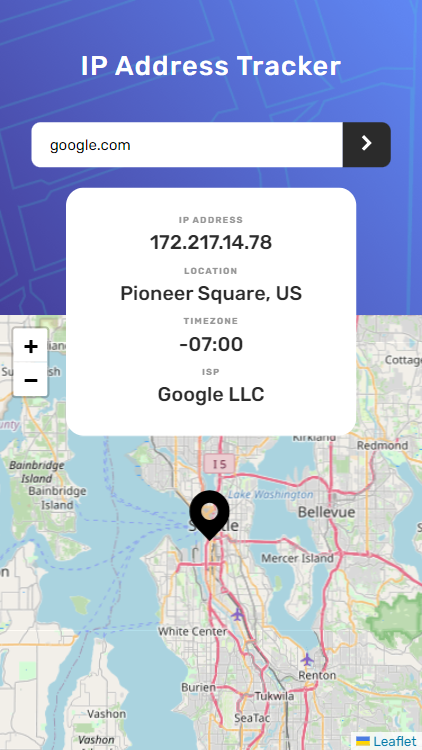

# Frontend Mentor - IP address tracker solution

This is a solution to the [IP address tracker challenge on Frontend Mentor](https://www.frontendmentor.io/challenges/ip-address-tracker-I8-0yYAH0).

## Table of contents

- [Frontend Mentor - IP address tracker solution](#frontend-mentor---ip-address-tracker-solution)
  - [Table of contents](#table-of-contents)
  - [Overview](#overview)
    - [The challenge](#the-challenge)
    - [Screenshot](#screenshot)
    - [Links](#links)
  - [My process](#my-process)
    - [Built with](#built-with)
    - [What I learned](#what-i-learned)
    - [Useful resources](#useful-resources)
  - [Author](#author)

## Overview

### The challenge

Users should be able to:

- View the optimal layout for each page depending on their device's screen size
- See hover states for all interactive elements on the page
- See their own IP address on the map on the initial page load
- Search for any IP addresses or domains and see the key information and location

### Screenshot

### Links

- Solution URL: [Add solution URL here](https://your-solution-url.com)
- Live Site URL: [Add live site URL here](https://your-live-site-url.com)

## My process

### Built with

- CSS custom properties
- Flex box
- Mobile-first workflow
- [React](https://reactjs.org/) - JS library
- [Vite](https://vite.dev/) - Package Bundler
- [React Leaflet](https://react-leaflet.js.org/) - For maps
- [GeoIPify](https://geo.ipify.org/) - For getting Ip details

### What I learned

Learnt how to use React Leaflet maps, ipify website.

### Useful resources

- [Geo IPIFY](https://geo.ipify.org/) - This helped me for receiving the IP details of the IP provided. I really liked this website and will use it going forward.
- [React Leaflet](https://react-leaflet.js.org/) - This is an amazing module which helped me finally insert Maps into the project. Also, it is easy to use. I'd recommend it to anyone still learning this concept.

## Author

- Website - [KarthikYerra]()
- Frontend Mentor - [@karthikyerra1](https://www.frontendmentor.io/profile/karthikyerra1)

